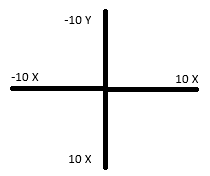

# 3DSlinux Buttons

####
####
## hid_buttons

| 3DS Button | Linux Input Code | Numeric Code |
|---|---|---:|
| A | `BTN_SOUTH` | `304` |
| B | `BTN_EAST` | `305` |
| X | `BTN_NORTH` | `307` |
| Y | `BTN_WEST` | `308` |
| L | `BTN_TL` | `310` |
| R | `BTN_TR` | `311` |
| Up | `KEY_UP` | `103` |
| Down | `KEY_DOWN` | `108` |
| Left | `KEY_LEFT` | `105` |
| Right | `KEY_RIGHT` | `106` |
| Select | `BTN_SELECT` | `314` |
| Start | `BTN_START` | `315` |

## mcu_buttons

| 3DS Button | Linux Input Code | Numeric Code | Notes |
|---|---|---:|---|
| Home | `KEY_HOME` | `102` | Momentary press/release event |
| WiFi Switch | `KEY_WIMAX` | `246` | Physical wireless switch; momentary press/release event |
| Power Button | `KEY_POWER` | `116` | Must hold for approx. one second. Probably shouldn't use, as it is easy to shut off system accidentally |

### Input Code Names vs. Numeric Codes

Linux represents input events using numeric codes. `evdev` provides human-readable names for many of these codes.

For example:

```python
ecodes.BTN_SOUTH
```

is the named version of:

```text
304
```

So these are equivalent:

```python
if event.code == 304:
```

and:

```python
if event.code == ecodes.BTN_SOUTH:
```

The numeric value is the actual code reported by the Linux input subsystem, while `BTN_SOUTH` is a predefined name that makes the code easier to understand.

The names also describe a generic controller layout rather than specifically referring to the 3DS. For example, Linux calls the bottom face button `BTN_SOUTH`, which the 3DS maps to A.

This means the mapping is essentially:

```text
(Physical A Button)
 ^
BTN_SOUTH
 ^
304
```

The same applies to the other buttons. You can see what codes correlate to what button via `buttonbindings.txt`.

#### Notes:

The WIFI switch and Home button both instantly release, no matter if the input is held.

`REL_X` and `REL_Y` (*from Nintendo 3DS touch HID, interestingly enough*) are interpreted by X11 (*tested on JWM*) as mouse movement, allowing the 3DS Slide Pad to control the mouse pointer.

`REL_X` and `REL_Y` seem to have `-10` to `10` as their possible values, as shown below:

The physical WIFI switch is handled by the 3DS MCU and generates a `KEY_WIMAX` input event.
Under Horizon OS (*the stock 3DS operating system*), this input is used to enable or disable wireless communication.

On 3DSLinux, the WIFI switch is not configured to disable wireless communication, meaning that `KEY_WIMAX` event can instead be used as a regular input, such as a gameplay button!
 This is shown in `moon-buggyclone.py`.

The switch generates a momentary press/release event rather than remaining pressed as well.

